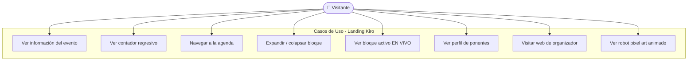
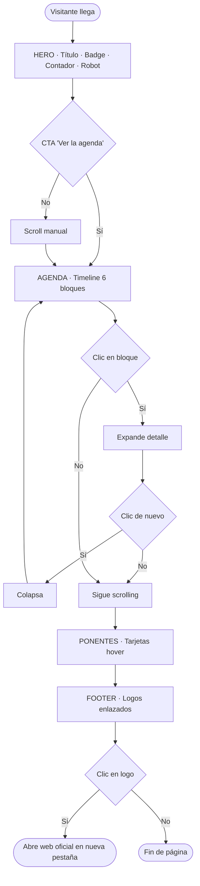

# Requirements · Landing Kiro en modo constructor

## 1. Objetivo del Sistema

Landing page informativa de una sola página (SPA estática) para el workshop **"Kiro en modo constructor: specs, agentes y una web real"** celebrado el 12 de septiembre de 2026 en la UNAB, Bucaramanga. La página es de **solo lectura**: comunica el evento ya celebrado, presenta la agenda, los ponentes y los organizadores. No hay flujos de registro, backend ni autenticación.

---

## 2. Secciones de la Página y Navegación

### Mapa de secciones

| ID sección | Ancla HTML  | Contenido principal |
|---|---|---|
| Hero       | `#hero`     | Título, badge "WORKSHOP GRATUITO", meta (fecha/hora/lugar), contador regresivo, robot pixel art, CTA a #agenda |
| Agenda     | `#agenda`   | Timeline interactivo 9:00–11:00 AM con 6 bloques; Flappy Kiro y Refrigerio destacados |
| Ponentes   | `#ponentes` | Tarjetas de Juliana Ramírez A. y José Verbel con bio, rol y charla |
| Footer     | —           | Logos enlazados de BucaraTec, AWS y UNAB con nombre oficial; créditos |

### Mapeo de botones e interacciones

| Elemento | Tipo | Comportamiento | Sección |
|---|---|---|---|
| "Ver la agenda ↓" | Botón CTA | Scroll suave a `#agenda` | Hero |
| Bloques de timeline | Card interactiva | Click/teclado expande/colapsa el bloque | Agenda |
| Bloque activo (evento en vivo) | Resaltado dinámico | JS detecta hora Colombia y añade badge "● EN VIVO" | Agenda |
| Tarjetas de ponente | Card hover | Efecto glow neón `#7aff00` al pasar el cursor | Ponentes |
| Logos de organizadores | Enlace externo | `target="_blank"` hacia URLs oficiales | Footer |
| Contador regresivo | Widget JS | Actualización cada segundo; muestra "¡El evento ya comenzó!" al llegar a cero | Hero |

---

## 3. Matriz de Requerimientos Funcionales y No Funcionales

### RF-01 · Hero informativo
El sistema debe mostrar en la parte superior de la página: el nombre del evento, un badge "WORKSHOP GRATUITO", la fecha, hora y lugar del evento, y un botón que lleve a la sección de agenda.

* **Criterios de aceptación (RF-01):**
  - [ ] El título "Kiro en modo constructor" es visible en todos los viewports
  - [ ] El badge neón es visible y legible en fondo oscuro
  - [ ] Los datos de fecha, hora y lugar son correctos (12 sep 2026, 9–11 AM, UNAB L51)
  - [ ] El botón CTA hace scroll suave hasta `#agenda`

* **Requerimientos No Funcionales Asociados:**
  - **RNF-01.1 (Usabilidad / Accesibilidad):** El botón CTA debe poseer un contraste de color no inferior a 4.5:1 (WCAG AA) y mostrar un indicador claro de `:focus-visible` al navegar por teclado.
  - **RNF-01.2 (Rendimiento LCP):** Los elementos del Hero deben renderizarse en el primer pintado con un *Largest Contentful Paint* (LCP) inferior a 1.2 segundos en conexiones moviles 4G.

---

### RF-02 · Contador regresivo en tiempo real
El sistema debe mostrar un contador regresivo (días, horas, minutos, segundos) hacia la fecha del evento. Cuando la fecha pasa, debe mostrar el mensaje "¡El evento ya comenzó!".

* **Criterios de aceptación (RF-02):**
  - [ ] Los 4 dígitos (D/H/M/S) se actualizan cada segundo sin recargar la página
  - [ ] Al superar la fecha objetivo (2026-09-12T09:00-05:00) el contador desaparece y aparece el mensaje
  - [ ] Los dígitos tienen animación flip al cambiar
  - [ ] La zona horaria usada es UTC-5 (Colombia)

* **Requerimientos No Funcionales Asociados:**
  - **RNF-02.1 (Eficiencia de Procesamiento):** La actualización del temporizador JS debe ejecutarse sin generar repintados masivos del DOM (*layout thrashing*), manteniendo un consumo de memoria ligero.
  - **RNF-02.2 (Sincronización de Estado):** La verificación del tiempo debe ser precisa en tiempo real respecto al reloj local del navegador ajustado a la zona horaria UTC-5.

---

### RF-03 · Agenda interactiva con timeline
La interfaz debe mostrar los 6 bloques de la agenda en formato timeline vertical con hora, etiqueta de tipo y descripción. El usuario puede hacer clic en un bloque para expandir/colapsar su detalle.

* **Criterios de aceptación (RF-03):**
  - [ ] 6 bloques visibles: 9:00, 9:15, 9:45, 10:00, 10:15, 11:00
  - [ ] El bloque de Flappy Kiro (10:15) tiene el badge "★ ESTRELLA" y borde neón
  - [ ] El bloque de Refrigerio (10:00) tiene estilo visual diferenciado
  - [ ] Click/Enter en un bloque expande el detalle; segundo click lo colapsa
  - [ ] Solo un bloque puede estar expandido a la vez

* **Requerimientos No Funcionales Asociados:**
  - **RNF-03.1 (Asequibilidad Táctil):** Las áreas de interacción de cada bloque de la agenda deben medir mínimo 44x44 píxeles para facilitar su despliegue en pantallas táctiles de celulares.
  - **RNF-03.2 (Fluidez de Animación):** La transición de expansión y colapso del bloque debe ejecutarse a 60 FPS mediante propiedades animables por GPU (`transform` u `opacity`).

---

### RF-04 · Resaltado de bloque activo en tiempo real
Durante las horas del evento (9:00–11:00 AM del 12 sep 2026, zona Colombia), el sistema debe resaltar el bloque de la agenda que corresponde al horario actual con un badge "● EN VIVO".

* **Criterios de aceptación (RF-04):**
  - [ ] El bloque activo muestra badge "● EN VIVO" parpadeante
  - [ ] El dot del timeline cambia a color neón con pulso
  - [ ] La detección se recalcula cada 30 segundos
  - [ ] Fuera del horario del evento no hay ningún bloque resaltado

* **Requerimientos No Funcionales Asociados:**
  - **RNF-04.1 (Bajo Consumo de Batería/CPU):** El bucle de verificación de bloque activo debe dormitar cuando la pestaña esté inactiva o en segundo plano utilizando `document.hidden`.

---

### RF-05 · Tarjetas de ponentes con efecto glow
La interfaz debe mostrar una tarjeta por cada ponente con: nombre, rol, organización, bio y la charla que presenta. Al pasar el cursor, la tarjeta debe mostrar un efecto de iluminación neón.

* **Criterios de aceptación (RF-05):**
  - [ ] Tarjeta de Juliana Ramírez A. con badge "AWS User Group"
  - [ ] Tarjeta de José Verbel con badge "Comunidad Tech"
  - [ ] Hover genera glow neón `#7aff00` y eleva la tarjeta
  - [ ] Las tarjetas son navegables con teclado (Tab + Enter)
  - [ ] En mobile las tarjetas se muestran en columna, en desktop en grid de 2

* **Requerimientos No Funcionales Asociados:**
  - **RNF-05.1 (Diseño Responsivo Fluido):** El grid de ponentes debe redistribuirse de forma fluida entre viewports de 375px y 1440px sin generar desplazamientos horizontales no deseados (*overflow-x*).
  - **RNF-05.2 (Consistencia Estética Neón):** La paleta neón `#7aff00` debe ser gestionada exclusivamente mediante variables globales en CSS `:root` (`--color-neon-accent`).

---

### RF-06 · Robot pixel art animado
La interfaz debe mostrar un robot pixel art animado en el hero. Si no existe la imagen `assets/hero-illustration.png`, debe mostrar el robot construido en CSS/HTML como fallback.

* **Criterios de aceptación (RF-06):**
  - [ ] El robot flota con animación vertical continua
  - [ ] Los ojos parpadean periódicamente
  - [ ] La pantalla del robot muestra snippets de código rotativos
  - [ ] El fallback CSS se activa automáticamente si la imagen falla

* **Requerimientos No Funcionales Asociados:**
  - **RNF-06.1 (Respeto a Preferencias del Usuario):** La animación flotante del robot debe desactivarse automáticamente si el sistema operativo del usuario tiene activa la opción `prefers-reduced-motion: reduce`.

---

### RF-07 · Footer con logos de organizadores enlazados
El footer debe mostrar los logos de BucaraTec, AWS y UNAB, cada uno con su nombre oficial en texto y enlazado a su web oficial en una nueva pestaña.

* **Criterios de aceptación (RF-07):**
  - [ ] BucaraTec → `https://bucaratec.com` con texto "BucaraTec"
  - [ ] AWS → `https://aws.amazon.com` con texto "Amazon Web Services – AWS"
  - [ ] UNAB → `https://unab.edu.co` con texto "Universidad Autónoma de Bucaramanga – UNAB"
  - [ ] Todos los enlaces usan `target="_blank" rel="noopener noreferrer"`
  - [ ] Hover sobre logo: `scale(1.05)` + drop-shadow neón
  - [ ] Si la imagen no carga, se muestra el nombre de la entidad como texto fallback

* **Requerimientos No Funcionales Asociados:**
  - **RNF-07.1 (Seguridad en Enlaces):** Todos los enlaces externos deben implementar obligatoriamente `rel="noopener noreferrer"` para mitigar vulnerabilidades de seguridad (*tabnabbing*).

---

### RF-08 · Animaciones de entrada con Intersection Observer
Los elementos de la página deben aparecer con una animación suave al entrar al viewport durante el scroll.

* **Criterios de aceptación (RF-08):**
  - [ ] Los elementos entran con `opacity 0→1` y `translateY(24px→0)`
  - [ ] La animación respeta `prefers-reduced-motion: reduce`
  - [ ] Cada elemento se anima una sola vez

* **Requerimientos No Funcionales Asociados:**
  - **RNF-08.1 (Mantenibilidad y Código Vanilla):** La implementación de animaciones de scroll no debe depender de librerías JS externas pesadas (como GSAP o ScrollMagic), utilizando exclusivamente la API nativa de JavaScript `IntersectionObserver`.

---

## 4. Alcance

### ✅ In-Scope
- Maquetación HTML5 semántica (Hero, Agenda, Ponentes, Footer)
- Estilos CSS3 responsivos con variables de marca y animaciones
- Contador regresivo Vanilla JS, agenda dinámica, animaciones IntersectionObserver
- Robot pixel art animado como ilustración/fallback
- Footer con logos enlazados a webs oficiales
- Documentación: README.md y spec

### ❌ Out-of-Scope
- Base de datos, backend, API REST
- Registro/RSVP o formularios funcionales
- Envío de correos y autenticación
- Analytics, i18n, CI/CD, panel de administración

---

## 5. Modelado Visual

### Diagrama de Casos de Uso

---

### Diagrama de Flujo de Navegación del Sitio

